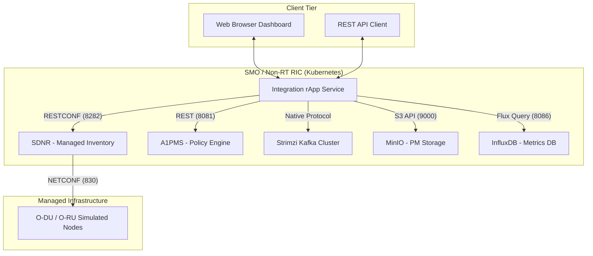

# O-RAN Integration rApp

A production-ready unified tool for verifying O-RAN-SC SMO and RIC deployments. This rApp provides a **Web GUI** and **CLI** to orchestrate and verify operations across SDNR, InfluxDB, Kafka, MinIO, and A1PMS.

---

## 🏛 Architecture Overview

The Integration rApp serves as a centralized service between the SMO Management layer and the RAN infrastructure. For a deep dive into internal data flows and API journeys, see [architecture.md](architecture.md).



### Supported Integrations
- **SDNR**: Management of NETCONF node inventory, administrative state (LOCK/UNLOCK/RESET), and retrieval of node configurations via `ietf-netconf` RPCs.
- **A1PMS**: Deployment and lifecycle management of A1 policies across supported RICs.
- **Kafka**: Real-time Performance Management (PM) data consumption and payload inspection from the message bus.
- **MinIO S3**: Persistence auditing for performance logs stored in XML and compressed JSON formats.
- **InfluxDB**: Monitoring of timeseries metrics and bucket health via the Flux query engine.

---

## 📁 Project Structure

```text
integration-rapp/
├── backend.py          # 🌐 Flask API: Exposes REST endpoints for rApp logic
├── cli.py              # ⌨️  CLI Utility: Command-line interface for SMO verification
├── config.yaml         # ⚙️  Configuration: Environment variables for SMO endpoints
├── helm/               # ☸️ Helm Chart: Production Kubernetes packaging
├── templates/          # 🎨 UI Assets (Dashboard)
├── requirements.txt    # 📦 Dependencies: Python package manifest
├── architecture.md     # 📄 Technical Docs: Sequence diagrams and data journeys
└── README.md           # 📄 User Manual: Deployment and API reference
```

---

## 🔗 API Reference

The rApp exposes a Flask-based REST API on port `5001`.

| Method | Endpoint | Description |
|:---:|---|---|
| `GET` | `/api/nodes` | List all SDNR registered nodes and connection statuses. |
| `POST` | `/api/nodes/<cell>/reset` | Performs a cell reset lifecycle (LOCK → UNLOCK) via SDNR. |
| `POST` | `/api/nodes/<id>/rpc/get-config` | Executes an `ietf-netconf:get-config` RPC for a specific node. |
| `GET` | `/api/kafka/topics` | Lists Kafka topics currently buffered in the message bus. |
| `GET` | `/api/kafka/topics/<name>/latest` | Fetches the latest available PM payload from a specific topic. |
| `GET` | `/api/integration-check` | Rapid heartbeat of A1PMS Policy and Kafka states. |
| `GET` | `/api/minio/files` | Recursive S3 scan for XML and compressed JSON (.json.gz) metrics. |
| `GET` | `/api/influxdb/buckets` | Flux-based audit of populated InfluxDB V2 buckets. |
| `POST` | `/api/policy` | Deploy a test A1-based threshold policy via A1PMS. |
| `GET` | `/api/policies` | List all active policies managed by the Non-RT RIC. |

---

## 🚀 Deployment

### 1. Build and Run Directly
```bash
pip install -r requirements.txt
python backend.py --host 0.0.0.0 --port 5001
```

### 2. Helm Deployment (Production)
```bash
# 1. Update ConfigMap with the latest Python code
kubectl create configmap integration-rapp-code -n smo --from-file=. --dry-run=client -o yaml | kubectl apply -f -

# 3. Verify Pods
kubectl get pods -n smo -l app=integration-rapp
```

---

## ⚙️ Configuration & Environment

The rApp can be configured via `config.yaml` or **Environment Variables** (recommended for production).

### 1. Environment Profiles

| Variable | Standard O-RAN SMO (9092) | Custom SCRAM SMO (9093) |
|:---|:---|:---|
| `SDNR_URL` | `http://sdnc.onap.svc.cluster.local:8282` | Same |
| `SDNR_USER` | `admin` | `strimzi-kafka-admin` |
| `SDNR_PASS` | `Kp8bJ4SXszMBEPXh` | (Your SCRAM Password) |
| `KAFKA_BOOTSTRAP` | `onap-strimzi-kafka-bootstrap:9092` | `onap-strimzi-kafka-bootstrap:9093` |
| `INFLUX_TOKEN` | (Standard Token) | (Hardened Token) |
| `A1PMS_URL` | `http://policymanagementservice.nonrtric:8081` | Same |

### 2. Priority Rules
The application follows this strict priority for settings:
1. **Environment Variables** (highest priority)
2. **`config.yaml` values**
3. **Internal Defaults** (lowest priority)

---

## ✅ Deployment Verification

After deployment, use the **Integration Heartbeat** dashboard to check:
- **SDNR Connected Nodes**: Green if RU/DU simulators are registered.
- **Kafka Message Bus**: Green if `pmreports` topic is active.
- **InfluxDB PM Storage**: Green if the token can list metrics buckets.
- **A1 Policy Management**: Green if A1PMS (Non-RT RIC) is reachable.

---

## 🛠 Troubleshooting

- **Broad UI / Layout Issues**: Ensure you are using the latest `templates/index.html` with the `max-width: 1400px` fix.
- **Kafka Auth Errors**: Check if you are using port **9093** for SCRAM or **9092** for Plaintext. The backend automatically detects the protocol based on credentials.
- **Find Service DNS Names**:
  ```bash
  kubectl get svc -A | grep -i 'a1pms\|sdnr\|influxdb\|kafka'
  ```
- **Find Strimzi Kafka Credentials**:
  ```bash
  kubectl get secret strimzi-kafka-admin -n onap -o jsonpath='{.data.password}' | base64 -d
  ```

---
*Production Documentation • O-RAN Integration rApp • v2.1*
