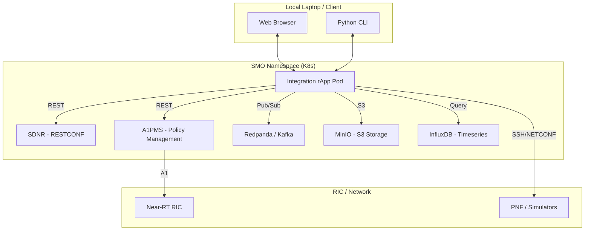

# O-RAN Integration rApp

A production-ready unified tool for verifying O-RAN-SC SMO and RIC deployments. This rApp provides a **Web GUI** and **CLI** to orchestrate and verify operations across SDNR, InfluxDB, Kafka, MinIO, and A1PMS.

---

## 🏛 Architecture Overview

The Integration rApp acting as a centralized "Integrator" between the SMO Services and the RIC Infrastructure.

## 📁 Project Structure

```text
integration-rapp/
├── backend.py          # 🌐 Flask API: Exposes REST endpoints for rApp logic
├── cli.py              # ⌨️  CLI Utility: Command-line interface for SMO verification
├── config.yaml         # ⚙️  Configuration: Environment variables for SMO/RIC endpoints
├── kafka_consume.sh    # 📨 Kafka Helper: Scripted consumer for peek operations
├── templates/          # 🎨 UI Assets
│   └── index.html      # 🌐 Dashboard: High-contrast production Web GUI
├── Dockerfile          # 🐳 Containerization: Blueprint for the rApp standard image
├── k8s-deployment.yaml # ☸️ K8s Manifest: Production Deployment & NodePort Service
├── requirements.txt    # 📦 Dependencies: Python package manifest
└── README.md           # 📄 Documentation: Architectural overview and manuals
```



### Core Services Integration
- **SDNR**: Management of NETCONF nodes and administrative state (LOCK/UNLOCK).
- **A1PMS**: Pushing intent-based policies to Near-RT RICs.
- **Kafka & MinIO**: Verification of Performance Management (PM) data pipelines.
- **InfluxDB**: Validation of timeseries data ingestion.

---

## 🔗 API Reference

The rApp exposes a Flask-based REST API on port `5001`.

| Method | Endpoint | Description |
|:---:|---|---|
| `GET` | `/api/nodes` | List all SDNR registered nodes and their connection status. |
| `POST` | `/api/nodes/<cell>/reset` | Performs a cell reset lifecycle (LOCK → UNLOCK). |
| `GET` | `/api/kafka/topics` | List Kafka/Redpanda topics currently containing data. |
| `GET` | `/api/kafka/topics/<name>/latest` | Fetch the absolute latest message from a specific topic. |
| `GET` | `/api/integration-check` | Comprehensive heartbeat of SDNR, Kafka, and RIC status. |
| `GET` | `/api/minio/files` | Summary of PM files (XML/JSON) stored in MinIO buckets. |
| `GET` | `/api/influxdb/buckets` | Audit of InfluxDB buckets receiving timeseries metrics. |
| `POST` | `/api/policy` | Deploy a test A1-based threshold policy via A1PMS. |
| `GET` | `/api/policies` | List all active policies currently managed by A1PMS. |

---

## 🚀 Deployment

### 1. Build and Run Directly
```bash
pip install -r requirements.txt
python backend.py --host 0.0.0.0 --port 5001
```

### 2. Kubernetes Deployment (Production)
The rApp is deployed in the `smo` namespace and accessible via a NodePort on `31001`.

```bash
# Update ConfigMap with latest code
kubectl create configmap integration-rapp-code -n smo --from-file=. --dry-run=client -o yaml | kubectl apply -f -

# Deploy the rApp
kubectl apply -f k8s-deployment.yaml
```

---

## 🛠 Maintenance & Configuration

All environment-specific variables are managed in `config.yaml`.
- Ensure `smo.host` is reachable from the rApp container.
- Update `influxdb_token` and `sdnr_password` as per your deployment security policy.

---
*Developed for O-RAN Deployment Verification • v1.2*
