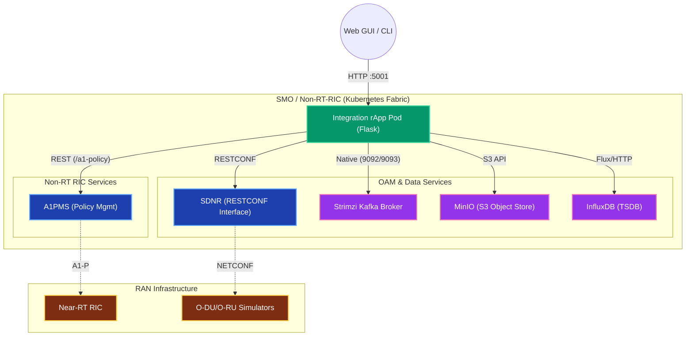
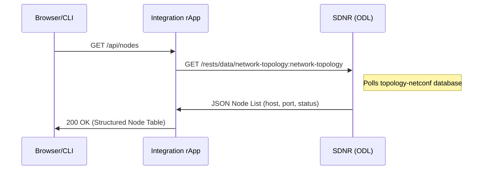
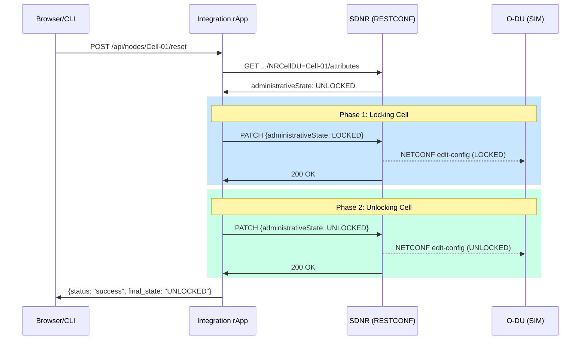
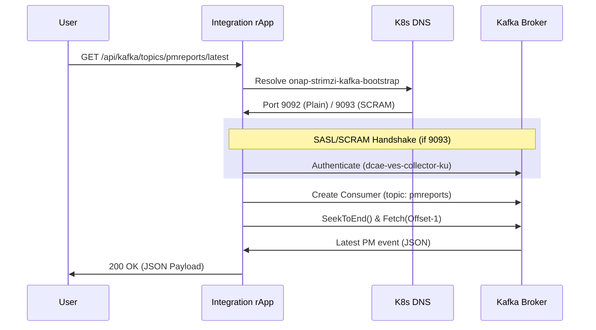
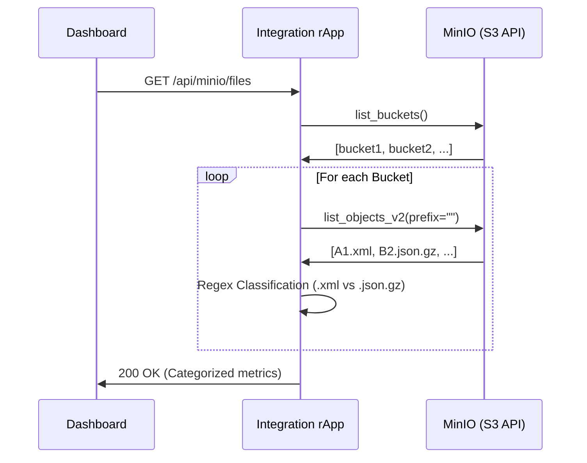
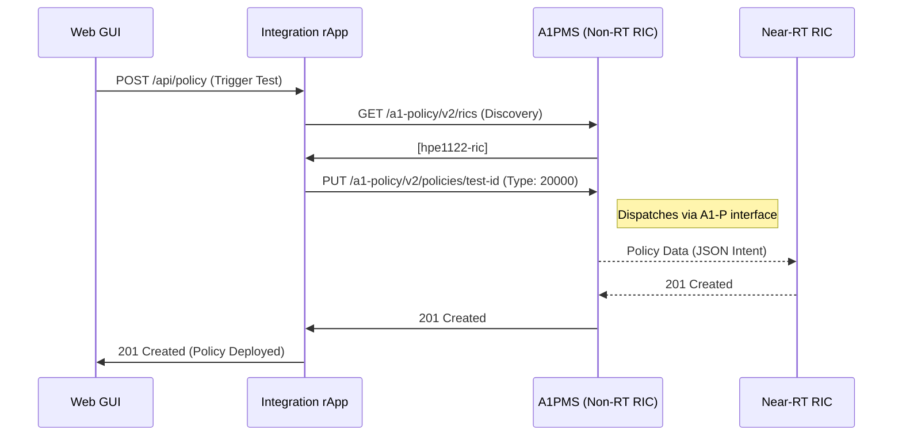

# O-RAN Integration rApp: Technical Architecture

This document provides a detailed technical overview of the Integration rApp's internal architecture, component interactions, and data flows within the O-RAN Service Management and Orchestration (SMO) layer.

---

## 1. System Topology

The Integration rApp serves as a centralized gateway for O-RAN SMO verification. It is deployed as a Kubernetes-native service within the `smo` namespace, utilizing internal ClusterIP DNS for all southbound communication.

---

## 2. Feature Data Flows

### A. SDNR: Node Inventory & Topology
Retrieves the real-time status of all registered NETCONF nodes (O-DUs/O-RUs) from the SDNR inventory.

**API Endpoint:** `GET /api/nodes`  
**Internal Path:** `.../network-topology:network-topology/topology=topology-netconf`

### B. SDNR: Cell Administration (LOCK/UNLOCK)
Automates the lifecycle management of NRCellDU entities via RESTCONF PATCH operations.

**API Endpoint:** `POST /api/nodes/<cell>/reset`

### C. Kafka: Native PM Data Consumption
Utilizes a native `kafka-python` consumer to verify performance management (PM) data packets on the internal message bus.

**API Endpoint:** `GET /api/kafka/topics/<name>/latest`

### D. MinIO: PM Persistence Audit (S3)
Scans MinIO buckets for both legacy XML and modern compressed JSON (`.json.gz`) PM logs.

**API Endpoint:** `GET /api/minio/files`

### E. A1PMS: Policy Management Lifecycle
Orchestrates the deployment and verification of intent-based policies via the Non-RT RIC.

**API Endpoint:** `POST /api/policy`

---
*Production Documentation • O-RAN Integration rApp • v2.1*
