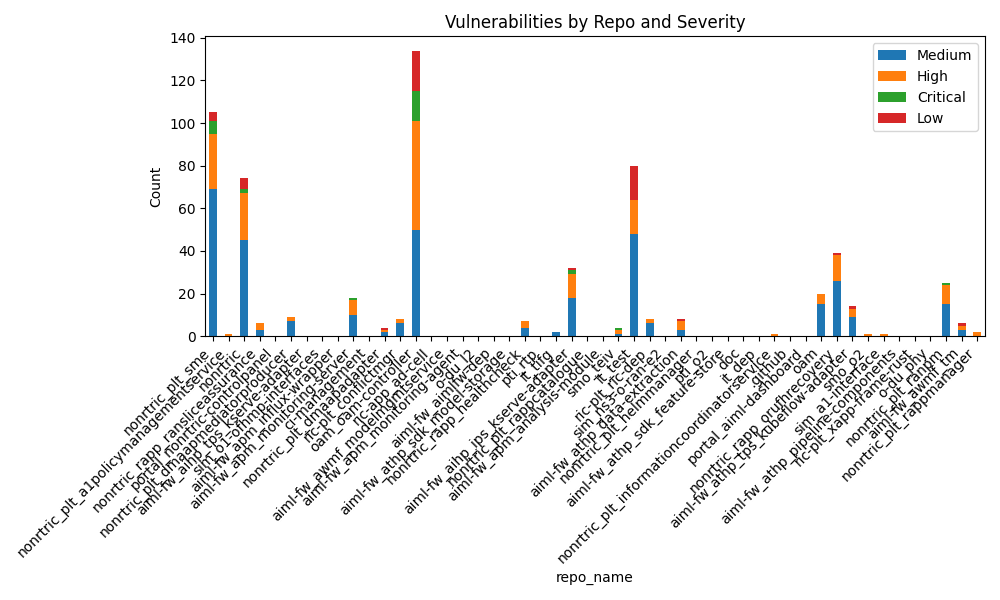
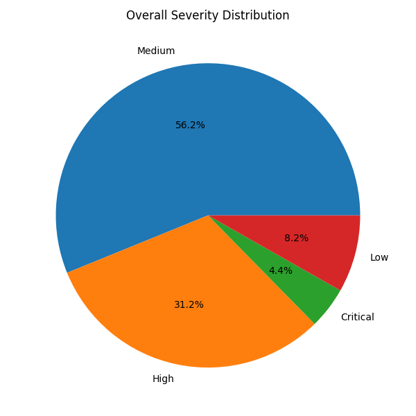

# Vulnerability Report by Repository

| repo_name                                  |   Medium |   High |   Critical |   Low |
|:-------------------------------------------|---------:|-------:|-----------:|------:|
| nonrtric_plt_sme                           |       69 |     26 |          6 |     4 |
| nonrtric_plt_a1policymanagementservice     |        0 |      1 |          0 |     0 |
| nonrtric                                   |       45 |     22 |          2 |     5 |
| nonrtric_rapp_ransliceassurance            |        3 |      3 |          0 |     0 |
| portal_nonrtric-controlpanel               |        0 |      0 |          0 |     0 |
| nonrtric_plt_dmaapmediatorproducer         |        7 |      2 |          0 |     0 |
| aiml-fw_aihp_tps_kserve-adapter            |        0 |      0 |          0 |     0 |
| sim_o1-ofhmp-interfaces                    |        0 |      0 |          0 |     0 |
| aiml-fw_apm_influx-wrapper                 |        0 |      0 |          0 |     0 |
| aiml-fw_apm_monitoring-server              |       10 |      7 |          1 |     0 |
| ci-management                              |        0 |      0 |          0 |     0 |
| nonrtric_plt_dmaapadapter                  |        2 |      1 |          0 |     1 |
| ric-plt_conflictmgr                        |        6 |      2 |          0 |     0 |
| oam_oam-controller                         |       50 |     51 |         14 |    19 |
| ric-app_ad-cell                            |        0 |      0 |          0 |     0 |
| aiml-fw_awmf_modelmgmtservice              |        0 |      0 |          0 |     0 |
| aiml-fw_apm_monitoring-agent               |        0 |      0 |          0 |     0 |
| o-du_l2                                    |        0 |      0 |          0 |     0 |
| aiml-fw_aimlfw-dep                         |        0 |      0 |          0 |     0 |
| aiml-fw_athp_sdk_model-storage             |        0 |      0 |          0 |     0 |
| nonrtric_rapp_healthcheck                  |        4 |      3 |          0 |     0 |
| pti_rtp                                    |        0 |      0 |          0 |     0 |
| it_tifg                                    |        2 |      0 |          0 |     0 |
| aiml-fw_aihp_ips_kserve-adapter            |       18 |     11 |          2 |     1 |
| nonrtric_plt_rappcatalogue                 |        0 |      0 |          0 |     0 |
| aiml-fw_apm_analysis-module                |        0 |      0 |          0 |     0 |
| smo_teiv                                   |        1 |      2 |          1 |     0 |
| it_test                                    |       48 |     16 |          0 |    16 |
| ric-plt_ric-dep                            |        6 |      2 |          0 |     0 |
| sim_ns3-o-ran-e2                           |        0 |      0 |          0 |     0 |
| aiml-fw_athp_data-extraction               |        3 |      4 |          0 |     1 |
| nonrtric_plt_helmmanager                   |        0 |      0 |          0 |     0 |
| pti_o2                                     |        0 |      0 |          0 |     0 |
| aiml-fw_athp_sdk_feature-store             |        0 |      0 |          0 |     0 |
| doc                                        |        0 |      0 |          0 |     0 |
| it_dep                                     |        0 |      0 |          0 |     0 |
| nonrtric_plt_informationcoordinatorservice |        0 |      1 |          0 |     0 |
| .github                                    |        0 |      0 |          0 |     0 |
| portal_aiml-dashboard                      |        0 |      0 |          0 |     0 |
| oam                                        |       15 |      5 |          0 |     0 |
| nonrtric_rapp_orufhrecovery                |       26 |     12 |          0 |     1 |
| aiml-fw_athp_tps_kubeflow-adapter          |        9 |      4 |          0 |     1 |
| smo_o2                                     |        0 |      1 |          0 |     0 |
| sim_a1-interface                           |        0 |      1 |          0 |     0 |
| aiml-fw_athp_pipeline-components           |        0 |      0 |          0 |     0 |
| ric-plt_xapp-frame-rust                    |        0 |      0 |          0 |     0 |
| o-du_phy                                   |        0 |      0 |          0 |     0 |
| nonrtric_plt_ranpm                         |       15 |      9 |          1 |     0 |
| aiml-fw_awmf_tm                            |        3 |      2 |          0 |     1 |
| nonrtric_plt_rappmanager                   |        0 |      2 |          0 |     0 |

## Critical CVEs

|   S.No | repo_name                       | package                        | cve                 | installed_version                  |   fixed_version | severity   |
|-------:|:--------------------------------|:-------------------------------|:--------------------|:-----------------------------------|----------------:|:-----------|
|      1 | nonrtric_plt_sme                | golang.org/x/crypto            | GHSA-v778-237x-gjrc | v0.14.0                            |             nan | Critical   |
|      2 | nonrtric_plt_sme                | golang.org/x/crypto            | GHSA-v778-237x-gjrc | v0.6.0                             |             nan | Critical   |
|      3 | nonrtric_plt_sme                | golang.org/x/crypto            | GHSA-v778-237x-gjrc | v0.6.0                             |             nan | Critical   |
|      4 | nonrtric_plt_sme                | golang.org/x/crypto            | GHSA-v778-237x-gjrc | v0.8.0                             |             nan | Critical   |
|      5 | nonrtric_plt_sme                | github.com/docker/docker       | GHSA-v23v-6jw2-98fq | v20.10.17+incompatible             |             nan | Critical   |
|      6 | nonrtric_plt_sme                | github.com/docker/docker       | GHSA-v23v-6jw2-98fq | v20.10.17+incompatible             |             nan | Critical   |
|      7 | nonrtric                        | golang.org/x/crypto            | GHSA-v778-237x-gjrc | v0.0.0-20211117183948-ae814b36b871 |             nan | Critical   |
|      8 | nonrtric                        | github.com/docker/docker       | GHSA-v23v-6jw2-98fq | v20.10.12+incompatible             |             nan | Critical   |
|      9 | aiml-fw_apm_monitoring-server   | golang.org/x/crypto            | GHSA-v778-237x-gjrc | v0.0.0-20220525230936-793ad666bf5e |             nan | Critical   |
|     10 | oam_oam-controller              | spring-web                     | GHSA-4wrc-f8pq-fpqp | 4.3.7.RELEASE                      |             nan | Critical   |
|     11 | oam_oam-controller              | loader-utils                   | GHSA-76p3-8jx3-jpfq | 0.2.16                             |             nan | Critical   |
|     12 | oam_oam-controller              | loader-utils                   | GHSA-76p3-8jx3-jpfq | 0.2.17                             |             nan | Critical   |
|     13 | oam_oam-controller              | minimist                       | GHSA-xvch-5gv4-984h | 0.0.10                             |             nan | Critical   |
|     14 | oam_oam-controller              | parse-url                      | GHSA-j9fq-vwqv-2fm2 | 6.0.5                              |             nan | Critical   |
|     15 | oam_oam-controller              | global-modules-path            | GHSA-vvj3-85vf-fgmw | 2.3.1                              |             nan | Critical   |
|     16 | oam_oam-controller              | cipher-base                    | GHSA-cpq7-6gpm-g9rc | 1.0.4                              |             nan | Critical   |
|     17 | oam_oam-controller              | pbkdf2                         | GHSA-v62p-rq8g-8h59 | 3.1.2                              |             nan | Critical   |
|     18 | oam_oam-controller              | sha.js                         | GHSA-95m3-7q98-8xr5 | 2.4.11                             |             nan | Critical   |
|     19 | oam_oam-controller              | pbkdf2                         | GHSA-h7cp-r72f-jxh6 | 3.1.2                              |             nan | Critical   |
|     20 | oam_oam-controller              | @babel/traverse                | GHSA-67hx-6x53-jw92 | 7.22.1                             |             nan | Critical   |
|     21 | oam_oam-controller              | babel-traverse                 | GHSA-67hx-6x53-jw92 | 6.26.0                             |             nan | Critical   |
|     22 | oam_oam-controller              | form-data                      | GHSA-fjxv-7rqg-78g4 | 2.3.3                              |             nan | Critical   |
|     23 | oam_oam-controller              | elliptic                       | GHSA-vjh7-7g9h-fjfh | 6.5.4                              |             nan | Critical   |
|     24 | aiml-fw_aihp_ips_kserve-adapter | golang.org/x/crypto            | GHSA-v778-237x-gjrc | v0.0.0-20211215153901-e495a2d5b3d3 |             nan | Critical   |
|     25 | aiml-fw_aihp_ips_kserve-adapter | github.com/emicklei/go-restful | GHSA-r48q-9g5r-8q2h | v2.11.0+incompatible               |             nan | Critical   |
|     26 | smo_teiv                        | postgresql                     | GHSA-24rp-q3w6-vc56 | 42.5.4                             |             nan | Critical   |
|     27 | nonrtric_plt_ranpm              | golang.org/x/crypto            | GHSA-v778-237x-gjrc | v0.13.0                            |             nan | Critical   |

## High CVEs

|   S.No | repo_name                                  | package                             | cve                 | installed_version                                          |   fixed_version | severity   |
|-------:|:-------------------------------------------|:------------------------------------|:--------------------|:-----------------------------------------------------------|----------------:|:-----------|
|      1 | nonrtric_plt_sme                           | github.com/docker/docker            | GHSA-232p-vwff-86mp | v20.10.17+incompatible                                     |             nan | High       |
|      2 | nonrtric_plt_sme                           | github.com/docker/docker            | GHSA-232p-vwff-86mp | v20.10.17+incompatible                                     |             nan | High       |
|      3 | nonrtric_plt_sme                           | helm.sh/helm/v3                     | GHSA-r53h-jv2g-vpx6 | v3.9.0                                                     |             nan | High       |
|      4 | nonrtric_plt_sme                           | helm.sh/helm/v3                     | GHSA-r53h-jv2g-vpx6 | v3.9.0                                                     |             nan | High       |
|      5 | nonrtric_plt_sme                           | golang.org/x/crypto                 | GHSA-hcg3-q754-cr77 | v0.14.0                                                    |             nan | High       |
|      6 | nonrtric_plt_sme                           | golang.org/x/crypto                 | GHSA-hcg3-q754-cr77 | v0.6.0                                                     |             nan | High       |
|      7 | nonrtric_plt_sme                           | golang.org/x/crypto                 | GHSA-hcg3-q754-cr77 | v0.6.0                                                     |             nan | High       |
|      8 | nonrtric_plt_sme                           | golang.org/x/crypto                 | GHSA-hcg3-q754-cr77 | v0.8.0                                                     |             nan | High       |
|      9 | nonrtric_plt_sme                           | golang.org/x/net                    | GHSA-4374-p667-p6c8 | v0.7.0                                                     |             nan | High       |
|     10 | nonrtric_plt_sme                           | golang.org/x/net                    | GHSA-4374-p667-p6c8 | v0.7.0                                                     |             nan | High       |
|     11 | nonrtric_plt_sme                           | golang.org/x/net                    | GHSA-4374-p667-p6c8 | v0.9.0                                                     |             nan | High       |
|     12 | nonrtric_plt_sme                           | github.com/getkin/kin-openapi       | GHSA-wq9g-9vfc-cfq9 | v0.106.0                                                   |             nan | High       |
|     13 | nonrtric_plt_sme                           | github.com/getkin/kin-openapi       | GHSA-wq9g-9vfc-cfq9 | v0.106.0                                                   |             nan | High       |
|     14 | nonrtric_plt_sme                           | github.com/getkin/kin-openapi       | GHSA-wq9g-9vfc-cfq9 | v0.116.0                                                   |             nan | High       |
|     15 | nonrtric_plt_sme                           | github.com/getkin/kin-openapi       | GHSA-wq9g-9vfc-cfq9 | v0.117.0                                                   |             nan | High       |
|     16 | nonrtric_plt_sme                           | github.com/docker/distribution      | GHSA-hqxw-f8mx-cpmw | v2.8.1+incompatible                                        |             nan | High       |
|     17 | nonrtric_plt_sme                           | github.com/docker/distribution      | GHSA-hqxw-f8mx-cpmw | v2.8.1+incompatible                                        |             nan | High       |
|     18 | nonrtric_plt_sme                           | golang.org/x/oauth2                 | GHSA-6v2p-p543-phr9 | v0.0.0-20211104180415-d3ed0bb246c8                         |             nan | High       |
|     19 | nonrtric_plt_sme                           | golang.org/x/oauth2                 | GHSA-6v2p-p543-phr9 | v0.0.0-20211104180415-d3ed0bb246c8                         |             nan | High       |
|     20 | nonrtric_plt_sme                           | github.com/golang-jwt/jwt           | GHSA-mh63-6h87-95cp | v3.2.2+incompatible                                        |             nan | High       |
|     21 | nonrtric_plt_sme                           | github.com/golang-jwt/jwt           | GHSA-mh63-6h87-95cp | v3.2.2+incompatible                                        |             nan | High       |
|     22 | nonrtric_plt_sme                           | pillow                              | GHSA-xg8h-j46f-w952 | 11.2.1                                                     |             nan | High       |
|     23 | nonrtric_plt_sme                           | helm.sh/helm/v3                     | GHSA-557j-xg8c-q2mm | v3.9.0                                                     |             nan | High       |
|     24 | nonrtric_plt_sme                           | helm.sh/helm/v3                     | GHSA-557j-xg8c-q2mm | v3.9.0                                                     |             nan | High       |
|     25 | nonrtric_plt_sme                           | google.golang.org/grpc              | GHSA-m425-mq94-257g | v1.47.0                                                    |             nan | High       |
|     26 | nonrtric_plt_sme                           | google.golang.org/grpc              | GHSA-m425-mq94-257g | v1.47.0                                                    |             nan | High       |
|     27 | nonrtric_plt_a1policymanagementservice     | pillow                              | GHSA-xg8h-j46f-w952 | 11.2.1                                                     |             nan | High       |
|     28 | nonrtric                                   | github.com/containerd/containerd    | GHSA-crp2-qrr5-8pq7 | v1.5.9                                                     |             nan | High       |
|     29 | nonrtric                                   | gopkg.in/yaml.v3                    | GHSA-hp87-p4gw-j4gq | v3.0.0-20200313102051-9f266ea9e77c                         |             nan | High       |
|     30 | nonrtric                                   | gopkg.in/yaml.v3                    | GHSA-hp87-p4gw-j4gq | v3.0.0-20210107192922-496545a6307b                         |             nan | High       |
|     31 | nonrtric                                   | github.com/docker/docker            | GHSA-232p-vwff-86mp | v20.10.12+incompatible                                     |             nan | High       |
|     32 | nonrtric                                   | golang.org/x/net                    | GHSA-vvpx-j8f3-3w6h | v0.0.0-20220107192237-5cfca573fb4d                         |             nan | High       |
|     33 | nonrtric                                   | helm.sh/helm/v3                     | GHSA-r53h-jv2g-vpx6 | v3.8.0                                                     |             nan | High       |
|     34 | nonrtric                                   | golang.org/x/crypto                 | GHSA-hcg3-q754-cr77 | v0.0.0-20211117183948-ae814b36b871                         |             nan | High       |
|     35 | nonrtric                                   | flask                               | GHSA-m2qf-hxjv-5gpq | 2.0.1                                                      |             nan | High       |
|     36 | nonrtric                                   | pip                                 | GHSA-5xp3-jfq3-5q8x | 20.1                                                       |             nan | High       |
|     37 | nonrtric                                   | golang.org/x/net                    | GHSA-4374-p667-p6c8 | v0.0.0-20220107192237-5cfca573fb4d                         |             nan | High       |
|     38 | nonrtric                                   | golang.org/x/net                    | GHSA-69cg-p879-7622 | v0.0.0-20220107192237-5cfca573fb4d                         |             nan | High       |
|     39 | nonrtric                                   | github.com/docker/distribution      | GHSA-hqxw-f8mx-cpmw | v2.7.1+incompatible                                        |             nan | High       |
|     40 | nonrtric                                   | golang.org/x/text                   | GHSA-ppp9-7jff-5vj2 | v0.3.2                                                     |             nan | High       |
|     41 | nonrtric                                   | golang.org/x/oauth2                 | GHSA-6v2p-p543-phr9 | v0.0.0-20211104180415-d3ed0bb246c8                         |             nan | High       |
|     42 | nonrtric                                   | golang.org/x/crypto                 | GHSA-8c26-wmh5-6g9v | v0.0.0-20211117183948-ae814b36b871                         |             nan | High       |
|     43 | nonrtric                                   | github.com/dgrijalva/jwt-go         | GHSA-w73w-5m7g-f7qc | v3.2.0+incompatible                                        |             nan | High       |
|     44 | nonrtric                                   | golang.org/x/text                   | GHSA-69ch-w2m2-3vjp | v0.3.2                                                     |             nan | High       |
|     45 | nonrtric                                   | golang.org/x/text                   | GHSA-69ch-w2m2-3vjp | v0.3.7                                                     |             nan | High       |
|     46 | nonrtric                                   | github.com/golang-jwt/jwt/v4        | GHSA-mh63-6h87-95cp | v4.1.0                                                     |             nan | High       |
|     47 | nonrtric                                   | golang.org/x/crypto                 | GHSA-gwc9-m7rh-j2ww | v0.0.0-20211117183948-ae814b36b871                         |             nan | High       |
|     48 | nonrtric                                   | helm.sh/helm/v3                     | GHSA-557j-xg8c-q2mm | v3.8.0                                                     |             nan | High       |
|     49 | nonrtric                                   | google.golang.org/grpc              | GHSA-m425-mq94-257g | v1.43.0                                                    |             nan | High       |
|     50 | nonrtric_rapp_ransliceassurance            | gopkg.in/yaml.v3                    | GHSA-hp87-p4gw-j4gq | v3.0.0-20200313102051-9f266ea9e77c                         |             nan | High       |
|     51 | nonrtric_rapp_ransliceassurance            | golang.org/x/text                   | GHSA-ppp9-7jff-5vj2 | v0.3.6                                                     |             nan | High       |
|     52 | nonrtric_rapp_ransliceassurance            | golang.org/x/text                   | GHSA-69ch-w2m2-3vjp | v0.3.6                                                     |             nan | High       |
|     53 | nonrtric_plt_dmaapmediatorproducer         | golang.org/x/net                    | GHSA-vvpx-j8f3-3w6h | v0.3.0                                                     |             nan | High       |
|     54 | nonrtric_plt_dmaapmediatorproducer         | golang.org/x/net                    | GHSA-4374-p667-p6c8 | v0.3.0                                                     |             nan | High       |
|     55 | aiml-fw_apm_monitoring-server              | gopkg.in/yaml.v3                    | GHSA-hp87-p4gw-j4gq | v3.0.0                                                     |             nan | High       |
|     56 | aiml-fw_apm_monitoring-server              | golang.org/x/net                    | GHSA-vvpx-j8f3-3w6h | v0.0.0-20220531201128-c960675eff93                         |             nan | High       |
|     57 | aiml-fw_apm_monitoring-server              | golang.org/x/crypto                 | GHSA-hcg3-q754-cr77 | v0.0.0-20220525230936-793ad666bf5e                         |             nan | High       |
|     58 | aiml-fw_apm_monitoring-server              | golang.org/x/net                    | GHSA-4374-p667-p6c8 | v0.0.0-20220531201128-c960675eff93                         |             nan | High       |
|     59 | aiml-fw_apm_monitoring-server              | golang.org/x/net                    | GHSA-69cg-p879-7622 | v0.0.0-20220531201128-c960675eff93                         |             nan | High       |
|     60 | aiml-fw_apm_monitoring-server              | golang.org/x/net                    | GHSA-fxg5-wq6x-vr4w | v0.0.0-20220531201128-c960675eff93                         |             nan | High       |
|     61 | aiml-fw_apm_monitoring-server              | golang.org/x/text                   | GHSA-69ch-w2m2-3vjp | v0.3.7                                                     |             nan | High       |
|     62 | nonrtric_plt_dmaapadapter                  | protobuf-java                       | GHSA-735f-pc8j-v9w8 | 4.0.0-rc-2                                                 |             nan | High       |
|     63 | ric-plt_conflictmgr                        | golang.org/x/net                    | GHSA-4374-p667-p6c8 | v0.10.0                                                    |             nan | High       |
|     64 | ric-plt_conflictmgr                        | google.golang.org/grpc              | GHSA-m425-mq94-257g | v1.52.0                                                    |             nan | High       |
|     65 | oam_oam-controller                         | spring-web                          | GHSA-ccgv-vj62-xf9h | 4.3.7.RELEASE                                              |             nan | High       |
|     66 | oam_oam-controller                         | json5                               | GHSA-9c47-m6qq-7p4h | 0.5.1                                                      |             nan | High       |
|     67 | oam_oam-controller                         | spring-web                          | GHSA-hgjh-9rj2-g67j | 4.3.7.RELEASE                                              |             nan | High       |
|     68 | oam_oam-controller                         | spring-web                          | GHSA-2wrp-6fg6-hmc5 | 4.3.7.RELEASE                                              |             nan | High       |
|     69 | oam_oam-controller                         | ip                                  | GHSA-2p57-rm9w-gvfp | 1.1.5                                                      |             nan | High       |
|     70 | oam_oam-controller                         | ip                                  | GHSA-2p57-rm9w-gvfp | 1.1.8                                                      |             nan | High       |
|     71 | oam_oam-controller                         | terser                              | GHSA-4wf5-vphf-c2xc | 3.17.0                                                     |             nan | High       |
|     72 | oam_oam-controller                         | ssri                                | GHSA-vx3p-948g-6vhq | 5.3.0                                                      |             nan | High       |
|     73 | oam_oam-controller                         | serialize-javascript                | GHSA-hxcc-f52p-wc94 | 1.9.1                                                      |             nan | High       |
|     74 | oam_oam-controller                         | lodash.set                          | GHSA-p6mc-m468-83gw | 4.3.2                                                      |             nan | High       |
|     75 | oam_oam-controller                         | trim-newlines                       | GHSA-7p7h-4mm5-852v | 1.0.0                                                      |             nan | High       |
|     76 | oam_oam-controller                         | trim-newlines                       | GHSA-7p7h-4mm5-852v | 2.0.0                                                      |             nan | High       |
|     77 | oam_oam-controller                         | lodash.template                     | GHSA-35jh-r3h4-6jhm | 4.5.0                                                      |             nan | High       |
|     78 | oam_oam-controller                         | json                                | GHSA-3vqj-43w4-2q58 | 20170516                                                   |             nan | High       |
|     79 | oam_oam-controller                         | json                                | GHSA-3vqj-43w4-2q58 | 20201115                                                   |             nan | High       |
|     80 | oam_oam-controller                         | ws                                  | GHSA-3h5v-q93c-6h6q | 5.2.3                                                      |             nan | High       |
|     81 | oam_oam-controller                         | json                                | GHSA-4jq9-2xhw-jpx7 | 20170516                                                   |             nan | High       |
|     82 | oam_oam-controller                         | json                                | GHSA-4jq9-2xhw-jpx7 | 20201115                                                   |             nan | High       |
|     83 | oam_oam-controller                         | merge                               | GHSA-7wpw-2hjm-89gp | 1.2.1                                                      |             nan | High       |
|     84 | oam_oam-controller                         | body-parser                         | GHSA-qwcr-r2fm-qrc7 | 1.20.1                                                     |             nan | High       |
|     85 | oam_oam-controller                         | jackson-databind                    | GHSA-57j2-w4cx-62h2 | 2.11.0                                                     |             nan | High       |
|     86 | oam_oam-controller                         | marked                              | GHSA-rrrm-qjm4-v8hf | 0.6.0                                                      |             nan | High       |
|     87 | oam_oam-controller                         | marked                              | GHSA-5v2h-r2cx-5xgj | 0.6.0                                                      |             nan | High       |
|     88 | oam_oam-controller                         | semver                              | GHSA-c2qf-rxjj-qqgw | 5.7.1                                                      |             nan | High       |
|     89 | oam_oam-controller                         | semver                              | GHSA-c2qf-rxjj-qqgw | 6.3.0                                                      |             nan | High       |
|     90 | oam_oam-controller                         | semver                              | GHSA-c2qf-rxjj-qqgw | 7.5.1                                                      |             nan | High       |
|     91 | oam_oam-controller                         | browserify-sign                     | GHSA-x9w5-v3q2-3rhw | 4.2.1                                                      |             nan | High       |
|     92 | oam_oam-controller                         | requirejs                           | GHSA-x3m3-4wpv-5vgc | 2.3.6                                                      |             nan | High       |
|     93 | oam_oam-controller                         | jackson-databind                    | GHSA-jjjh-jjxp-wpff | 2.11.0                                                     |             nan | High       |
|     94 | oam_oam-controller                         | braces                              | GHSA-grv7-fg5c-xmjg | 1.8.5                                                      |             nan | High       |
|     95 | oam_oam-controller                         | braces                              | GHSA-grv7-fg5c-xmjg | 2.3.2                                                      |             nan | High       |
|     96 | oam_oam-controller                         | braces                              | GHSA-grv7-fg5c-xmjg | 3.0.2                                                      |             nan | High       |
|     97 | oam_oam-controller                         | webpack-dev-middleware              | GHSA-wr3j-pwj9-hqq6 | 3.4.0                                                      |             nan | High       |
|     98 | oam_oam-controller                         | ansi-html                           | GHSA-whgm-jr23-g3j9 | 0.0.7                                                      |             nan | High       |
|     99 | oam_oam-controller                         | jackson-databind                    | GHSA-rgv9-q543-rqg4 | 2.11.0                                                     |             nan | High       |
|    100 | oam_oam-controller                         | path-to-regexp                      | GHSA-9wv6-86v2-598j | 0.1.7                                                      |             nan | High       |
|    101 | oam_oam-controller                         | path-to-regexp                      | GHSA-9wv6-86v2-598j | 1.8.0                                                      |             nan | High       |
|    102 | oam_oam-controller                         | http-cache-semantics                | GHSA-rc47-6667-2j5j | 3.8.1                                                      |             nan | High       |
|    103 | oam_oam-controller                         | chart.js                            | GHSA-h68q-55jf-x68w | 2.8.0                                                      |             nan | High       |
|    104 | oam_oam-controller                         | http-proxy-middleware               | GHSA-c7qv-q95q-8v27 | 0.18.0                                                     |             nan | High       |
|    105 | oam_oam-controller                         | jackson-databind                    | GHSA-3x8x-79m2-3w2w | 2.11.0                                                     |             nan | High       |
|    106 | oam_oam-controller                         | cross-spawn                         | GHSA-3xgq-45jj-v275 | 6.0.5                                                      |             nan | High       |
|    107 | oam_oam-controller                         | cross-spawn                         | GHSA-3xgq-45jj-v275 | 7.0.3                                                      |             nan | High       |
|    108 | oam_oam-controller                         | parse-path                          | GHSA-3j8f-xvm3-ffx4 | 4.0.4                                                      |             nan | High       |
|    109 | oam_oam-controller                         | node-forge                          | GHSA-x4jg-mjrx-434g | 0.10.0                                                     |             nan | High       |
|    110 | oam_oam-controller                         | html-minifier                       | GHSA-pfq8-rq6v-vf5m | 3.5.21                                                     |             nan | High       |
|    111 | oam_oam-controller                         | node-forge                          | GHSA-cfm4-qjh2-4765 | 0.10.0                                                     |             nan | High       |
|    112 | oam_oam-controller                         | path-to-regexp                      | GHSA-rhx6-c78j-4q9w | 0.1.7                                                      |             nan | High       |
|    113 | oam_oam-controller                         | jsonwebtoken                        | GHSA-8cf7-32gw-wr33 | 8.3.0                                                      |             nan | High       |
|    114 | oam_oam-controller                         | jetty-server                        | GHSA-q4rv-gq96-w7c5 | 9.4.54.v20240208                                           |             nan | High       |
|    115 | oam_oam-controller                         | jackson-core                        | GHSA-h46c-h94j-95f3 | 2.11.0                                                     |             nan | High       |
|    116 | nonrtric_rapp_healthcheck                  | pygments                            | GHSA-pq64-v7f5-gqh8 | 2.3.1                                                      |             nan | High       |
|    117 | nonrtric_rapp_healthcheck                  | flask                               | GHSA-m2qf-hxjv-5gpq | 2.1.1                                                      |             nan | High       |
|    118 | nonrtric_rapp_healthcheck                  | pygments                            | GHSA-9w8r-397f-prfh | 2.3.1                                                      |             nan | High       |
|    119 | aiml-fw_aihp_ips_kserve-adapter            | github.com/prometheus/client_golang | GHSA-cg3q-j54f-5p7p | v1.7.1                                                     |             nan | High       |
|    120 | aiml-fw_aihp_ips_kserve-adapter            | github.com/docker/distribution      | GHSA-h62f-wm92-2cmw | v0.0.0-20191216044856-a8371794149d                         |             nan | High       |
|    121 | aiml-fw_aihp_ips_kserve-adapter            | golang.org/x/net                    | GHSA-vvpx-j8f3-3w6h | v0.4.0                                                     |             nan | High       |
|    122 | aiml-fw_aihp_ips_kserve-adapter            | github.com/moby/moby                | GHSA-gh5c-3h97-2f3q | v17.12.0-ce-rc1.0.20200618181300-9dc6525e6118+incompatible |             nan | High       |
|    123 | aiml-fw_aihp_ips_kserve-adapter            | golang.org/x/crypto                 | GHSA-hcg3-q754-cr77 | v0.0.0-20211215153901-e495a2d5b3d3                         |             nan | High       |
|    124 | aiml-fw_aihp_ips_kserve-adapter            | github.com/gogo/protobuf            | GHSA-c3h9-896r-86jm | v1.3.1                                                     |             nan | High       |
|    125 | aiml-fw_aihp_ips_kserve-adapter            | github.com/moby/moby                | GHSA-2mj3-vfvx-fc43 | v17.12.0-ce-rc1.0.20200618181300-9dc6525e6118+incompatible |             nan | High       |
|    126 | aiml-fw_aihp_ips_kserve-adapter            | golang.org/x/net                    | GHSA-4374-p667-p6c8 | v0.4.0                                                     |             nan | High       |
|    127 | aiml-fw_aihp_ips_kserve-adapter            | github.com/docker/distribution      | GHSA-hqxw-f8mx-cpmw | v0.0.0-20191216044856-a8371794149d                         |             nan | High       |
|    128 | aiml-fw_aihp_ips_kserve-adapter            | golang.org/x/oauth2                 | GHSA-6v2p-p543-phr9 | v0.0.0-20210323180902-22b0adad7558                         |             nan | High       |
|    129 | aiml-fw_aihp_ips_kserve-adapter            | golang.org/x/crypto                 | GHSA-8c26-wmh5-6g9v | v0.0.0-20211215153901-e495a2d5b3d3                         |             nan | High       |
|    130 | smo_teiv                                   | httpclient5                         | GHSA-73m2-qfq3-56cx | 5.4.1                                                      |             nan | High       |
|    131 | smo_teiv                                   | pillow                              | GHSA-xg8h-j46f-w952 | 11.2.1                                                     |             nan | High       |
|    132 | it_test                                    | cryptography                        | GHSA-x4qr-2fvf-3mr5 | 3.4.8                                                      |             nan | High       |
|    133 | it_test                                    | cryptography                        | GHSA-x4qr-2fvf-3mr5 | 3.4.8                                                      |             nan | High       |
|    134 | it_test                                    | cryptography                        | GHSA-x4qr-2fvf-3mr5 | 3.4.8                                                      |             nan | High       |
|    135 | it_test                                    | cryptography                        | GHSA-x4qr-2fvf-3mr5 | 3.4.8                                                      |             nan | High       |
|    136 | it_test                                    | cryptography                        | GHSA-3ww4-gg4f-jr7f | 3.4.8                                                      |             nan | High       |
|    137 | it_test                                    | cryptography                        | GHSA-3ww4-gg4f-jr7f | 3.4.8                                                      |             nan | High       |
|    138 | it_test                                    | cryptography                        | GHSA-3ww4-gg4f-jr7f | 3.4.8                                                      |             nan | High       |
|    139 | it_test                                    | cryptography                        | GHSA-3ww4-gg4f-jr7f | 3.4.8                                                      |             nan | High       |
|    140 | it_test                                    | ansible                             | GHSA-cpx3-93w7-457x | 4.10.0                                                     |             nan | High       |
|    141 | it_test                                    | ansible                             | GHSA-cpx3-93w7-457x | 5.7.1                                                      |             nan | High       |
|    142 | it_test                                    | ansible                             | GHSA-cpx3-93w7-457x | 5.7.1                                                      |             nan | High       |
|    143 | it_test                                    | ansible                             | GHSA-cpx3-93w7-457x | 5.7.1                                                      |             nan | High       |
|    144 | it_test                                    | ansible-core                        | GHSA-jpxc-vmjf-9fcj | 2.11.11                                                    |             nan | High       |
|    145 | it_test                                    | ansible-core                        | GHSA-jpxc-vmjf-9fcj | 2.12.5                                                     |             nan | High       |
|    146 | it_test                                    | ansible-core                        | GHSA-jpxc-vmjf-9fcj | 2.12.5                                                     |             nan | High       |
|    147 | it_test                                    | ansible-core                        | GHSA-jpxc-vmjf-9fcj | 2.12.5                                                     |             nan | High       |
|    148 | ric-plt_ric-dep                            | golang.org/x/net                    | GHSA-4374-p667-p6c8 | v0.10.0                                                    |             nan | High       |
|    149 | ric-plt_ric-dep                            | golang.org/x/oauth2                 | GHSA-6v2p-p543-phr9 | v0.5.0                                                     |             nan | High       |
|    150 | aiml-fw_athp_data-extraction               | werkzeug                            | GHSA-xg9f-g7g7-2323 | 2.2.2                                                      |             nan | High       |
|    151 | aiml-fw_athp_data-extraction               | flask                               | GHSA-m2qf-hxjv-5gpq | 2.0.1                                                      |             nan | High       |
|    152 | aiml-fw_athp_data-extraction               | flask                               | GHSA-m2qf-hxjv-5gpq | 2.0.1                                                      |             nan | High       |
|    153 | aiml-fw_athp_data-extraction               | werkzeug                            | GHSA-2g68-c3qc-8985 | 2.2.2                                                      |             nan | High       |
|    154 | nonrtric_plt_informationcoordinatorservice | json                                | GHSA-4jq9-2xhw-jpx7 | 20230227                                                   |             nan | High       |
|    155 | oam                                        | golang.org/x/net                    | GHSA-vvpx-j8f3-3w6h | v0.0.0-20210405180319-a5a99cb37ef4                         |             nan | High       |
|    156 | oam                                        | golang.org/x/net                    | GHSA-4374-p667-p6c8 | v0.0.0-20210405180319-a5a99cb37ef4                         |             nan | High       |
|    157 | oam                                        | golang.org/x/net                    | GHSA-69cg-p879-7622 | v0.0.0-20210405180319-a5a99cb37ef4                         |             nan | High       |
|    158 | oam                                        | golang.org/x/oauth2                 | GHSA-6v2p-p543-phr9 | v0.0.0-20200107190931-bf48bf16ab8d                         |             nan | High       |
|    159 | oam                                        | golang.org/x/net                    | GHSA-83g2-8m93-v3w7 | v0.0.0-20210405180319-a5a99cb37ef4                         |             nan | High       |
|    160 | nonrtric_rapp_orufhrecovery                | gopkg.in/yaml.v3                    | GHSA-hp87-p4gw-j4gq | v3.0.0-20200313102051-9f266ea9e77c                         |             nan | High       |
|    161 | nonrtric_rapp_orufhrecovery                | urllib3                             | GHSA-q2q7-5pp4-w6pg | 1.26.4                                                     |             nan | High       |
|    162 | nonrtric_rapp_orufhrecovery                | urllib3                             | GHSA-q2q7-5pp4-w6pg | 1.26.4                                                     |             nan | High       |
|    163 | nonrtric_rapp_orufhrecovery                | urllib3                             | GHSA-v845-jxx5-vc9f | 1.26.4                                                     |             nan | High       |
|    164 | nonrtric_rapp_orufhrecovery                | urllib3                             | GHSA-v845-jxx5-vc9f | 1.26.4                                                     |             nan | High       |
|    165 | nonrtric_rapp_orufhrecovery                | werkzeug                            | GHSA-xg9f-g7g7-2323 | 1.0.1                                                      |             nan | High       |
|    166 | nonrtric_rapp_orufhrecovery                | flask                               | GHSA-m2qf-hxjv-5gpq | 1.1.2                                                      |             nan | High       |
|    167 | nonrtric_rapp_orufhrecovery                | werkzeug                            | GHSA-2g68-c3qc-8985 | 1.0.1                                                      |             nan | High       |
|    168 | nonrtric_rapp_orufhrecovery                | certifi                             | GHSA-xqr8-7jwr-rhp7 | 2020.12.5                                                  |             nan | High       |
|    169 | nonrtric_rapp_orufhrecovery                | certifi                             | GHSA-xqr8-7jwr-rhp7 | 2020.12.5                                                  |             nan | High       |
|    170 | nonrtric_rapp_orufhrecovery                | golang.org/x/text                   | GHSA-ppp9-7jff-5vj2 | v0.3.2                                                     |             nan | High       |
|    171 | nonrtric_rapp_orufhrecovery                | golang.org/x/text                   | GHSA-69ch-w2m2-3vjp | v0.3.2                                                     |             nan | High       |
|    172 | aiml-fw_athp_tps_kubeflow-adapter          | werkzeug                            | GHSA-xg9f-g7g7-2323 | 1.0.1                                                      |             nan | High       |
|    173 | aiml-fw_athp_tps_kubeflow-adapter          | flask                               | GHSA-m2qf-hxjv-5gpq | 1.1.2                                                      |             nan | High       |
|    174 | aiml-fw_athp_tps_kubeflow-adapter          | werkzeug                            | GHSA-2g68-c3qc-8985 | 1.0.1                                                      |             nan | High       |
|    175 | aiml-fw_athp_tps_kubeflow-adapter          | flask-cors                          | GHSA-hxwh-jpp2-84pm | 4.0.1                                                      |             nan | High       |
|    176 | smo_o2                                     | pillow                              | GHSA-xg8h-j46f-w952 | 11.2.1                                                     |             nan | High       |
|    177 | sim_a1-interface                           | pillow                              | GHSA-xg8h-j46f-w952 | 11.2.1                                                     |             nan | High       |
|    178 | nonrtric_plt_ranpm                         | gopkg.in/yaml.v3                    | GHSA-hp87-p4gw-j4gq | v3.0.0-20210107192922-496545a6307b                         |             nan | High       |
|    179 | nonrtric_plt_ranpm                         | golang.org/x/net                    | GHSA-vvpx-j8f3-3w6h | v0.0.0-20210405180319-a5a99cb37ef4                         |             nan | High       |
|    180 | nonrtric_plt_ranpm                         | golang.org/x/crypto                 | GHSA-hcg3-q754-cr77 | v0.13.0                                                    |             nan | High       |
|    181 | nonrtric_plt_ranpm                         | golang.org/x/net                    | GHSA-4374-p667-p6c8 | v0.0.0-20210405180319-a5a99cb37ef4                         |             nan | High       |
|    182 | nonrtric_plt_ranpm                         | golang.org/x/net                    | GHSA-4374-p667-p6c8 | v0.15.0                                                    |             nan | High       |
|    183 | nonrtric_plt_ranpm                         | golang.org/x/net                    | GHSA-69cg-p879-7622 | v0.0.0-20210405180319-a5a99cb37ef4                         |             nan | High       |
|    184 | nonrtric_plt_ranpm                         | golang.org/x/oauth2                 | GHSA-6v2p-p543-phr9 | v0.0.0-20200107190931-bf48bf16ab8d                         |             nan | High       |
|    185 | nonrtric_plt_ranpm                         | golang.org/x/oauth2                 | GHSA-6v2p-p543-phr9 | v0.12.0                                                    |             nan | High       |
|    186 | nonrtric_plt_ranpm                         | golang.org/x/net                    | GHSA-83g2-8m93-v3w7 | v0.0.0-20210405180319-a5a99cb37ef4                         |             nan | High       |
|    187 | aiml-fw_awmf_tm                            | werkzeug                            | GHSA-xg9f-g7g7-2323 | 2.2.2                                                      |             nan | High       |
|    188 | aiml-fw_awmf_tm                            | werkzeug                            | GHSA-2g68-c3qc-8985 | 2.2.2                                                      |             nan | High       |
|    189 | nonrtric_plt_rappmanager                   | pillow                              | GHSA-xg8h-j46f-w952 | 11.2.1                                                     |             nan | High       |
|    190 | nonrtric_plt_rappmanager                   | pillow                              | GHSA-xg8h-j46f-w952 | 11.2.1                                                     |             nan | High       |

## Charts

